**关于电路图**：本项目的五张电路图（`rc_circuit.png`、`thevenin_network.png`、`mos_circuit.png`、
`mos_dc_path.png`、`mos_small_signal.png`）由 `draw_circuits.py` 用程序绘制。
**手绘原稿另附**（任务书要求「电路图自己画」，三题的电路图均以手绘稿为准）：
`pyspice-circuits/images/1.jpg`（电路① 的 RC 低通电路 + 电路② 的含源二端网络）、
`pyspice-circuits/images/2.jpg`（电路③ 的共源放大电路）。

# 网页端贪吃蛇小游戏

使用ai开发和管理仓库的网页贪吃蛇游戏，基于html，css与JavaScript。

本项目使用MIT开源协议，因为MIT协议具有极其宽松的开源许可范围。

---

cd指choose directory，用于切换工作目录；ls指list，用于列出目录下的所有子文件和子目录；mkdir用于在当前目录下创建新的子文件夹

常用git命令有git init、git push、git pull、git clone、git add等

在开发中发现,ai认为在预输入队列中留下两次输入缓存足够预防高频输入导致的蛇头卡入身体导致游戏失败的问题，但在测试中，我尝试进行乱序高频输入以压力测试程序，发现仍会触发该bug，
因此我将预输入队列延长至3次输入，在后续测试中发现该bug得到了较大改善，仅在极端情况下可能触发。在与ai分析该模块代码后发现问题出现在对预输入队列队头的丢弃选择与队列长度以及可入队列输入判定存在缺陷，
在后续修改中分别改进了这三点：延长预输入队列、在队列已满时丢弃最新输入、要求可入队输入不与任意队列中输入方向相反。

蛇的移动思路：先读取direction，获取当前蛇头朝向，而后朝direction方向新建蛇头，判断是否吃到食物。若吃到食物，则取消蛇尾的删除，从而实现蛇身的增长；若未吃到食物，则删除最后一格蛇身，用户层表现则为蛇向前移动一格。

需注意的是，当蛇头恰好进入最后一段蛇身所在格时，属于合法移动，不能判定为撞到蛇身，故应先进行尾部蛇身的移除，再进行自撞判定，防止出现误判。

蛇的碰撞判定思路：碰撞分为三个模块，分别是碰撞到地图边界、碰撞到自身蛇身、以及碰撞到食物。

关于碰撞边界，只需检测newhead的位置，若判定位于地图外，则转为gameover状态。关于地图边界，其实本来想做newhead传送到另一侧，
但是考虑到这样的话上手操作有点反逻辑，而且游戏难度会变得太低，所以没有提这个prompt（

碰撞自身的判定，选择的依旧是newhead位置检测，判断是否与蛇身记录数组中的数字一致；若一致，则说明新蛇头将与蛇身碰撞，转为gameover状态。关于蛇尾处理，在蛇身移动中已经提过，这里不过多赘述。

碰撞食物时，选择了一条完整的判定链条：首先进行前面说的碰撞边界与自身的判定，若均无，则进入到食物判定。当newhead坐标与food坐标严格重合时判定为ate，而后进行加分、刷新得分ui、检测得分与胜利条件并暂停本次蛇尾删除。
若得分未到达设定的胜利条件，则执行spawnfood()，若已达到胜利条件，则执行win()。

---

## 开发中使用的关键提示词

### 1.我需要制作一个基于HTML的网页贪吃蛇小游戏，请分析该任务所需的模块并生成一份文档向我介绍

>这一步旨在拆解该任务，分为多个更清晰的小模块。一方面能使后续维护和调试更方便；另一方面可以更好地发挥ai的编程能力。

### 2.审查预输入队列模块代码，解释方向队列保留机制

>执行这一步前在分步填充框架，完善程序内容。此时在测试中发现有控制逻辑和输入保留逻辑的缺陷，故让ai审查代码并解释机制，从而分点分模块解决问题，发挥模块化任务的优势，防止问题在开发中积重难返。

### 3.分析将该程序进行移动端适配所需模块与步骤

### 4.按顺序进行步骤1，2，3，5，；并将该分析写入设计文档

>这两步同样在进行任务前对任务进行分解，并且有意识地保存设计方案与历程，方便后续开发中总结经验与教训，少走弯路。

---

## 阶段一任务实现

>该阶段核心思路是：先规划，后执行。
>
>将编写整个程序的任务拆解为：

1. 搭建页面骨架与画布，绘制静态网格
2. 实现蛇的数据结构与渲染
3. 实现主循环 + 键盘输入，让蛇动起来
4. 加入食物生成与吃食物增长
5. 加入碰撞检测（撞墙 / 自撞）与游戏结束
6. 加入计分、最高分、难度递增
7. 完善状态机（开始/暂停/重启）与 UI
8. 移动端适配、视觉打磨

这样，就能将一步步将完整程序以模块化的方式拼装起来。验证方式也很简单，将程序打包发给更多人测试并收集反馈，打磨优化，改进bug。

## 阶段二任务实现

>基于bfs函数，从代码中直接读取食物所在坐标并寻找最短路径，辅以跟随蛇尾的代码，保证ai的生存率
>
>在验证中调用node脚本快速试运行50次，通过率达到百分百，平均分数达136分，最低分31，显然已达到验收标准。

---

## PySpice 三电路（进阶挑战）

用 PySpice + ngspice 对三个电路做「**手算 → 仿真 → 对比表 → 误差分析**」的完整闭环验证。
全部代码、电路图与波形图在 `pyspice-circuits/` 目录下。

**环境**：Python 3.12.10 ／ PySpice 1.5 ／ ngspice 34 ／ numpy 2.5.3 ／ matplotlib 3.11.2
（ngspice 引擎随 PySpice 装在 `pyspice-circuits/.venv/` 内，无需单独安装）

**运行方式**：

```bash
pip install PySpice numpy matplotlib
cd pyspice-circuits
python draw_circuits.py       # 生成五张电路图
python rc_filter.py           # 电路①：瞬态 + 波特图
python thevenin.py            # 电路②：V_oc / I_sc / R_th + 负载验证表 + 端口 I-V 曲线
python mos_common_source.py   # 电路③：Q 点 + 反相放大 + 频响 + 四个误差排除实验
```

每个脚本跑完都会在终端打印「手算 vs 仿真」对比表，下文表格即这些输出的誊写。

---

### 目录

- [一、RC 低通滤波电路](#一rc-低通滤波电路)
- [二、戴维南定理验证](#二戴维南定理验证)
- [三、NMOS 共源级放大电路](#三nmos-共源级放大电路)
- [四、总结与踩坑记录](#四总结与踩坑记录)
- [五、AI 使用声明](#五ai-使用声明)

---

### 一、RC 低通滤波电路

#### 1.1 电路图

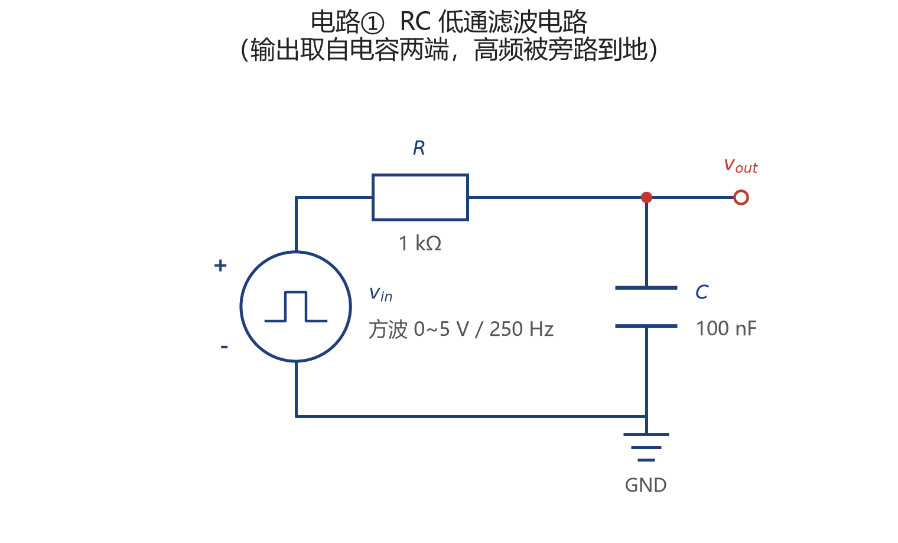

**元件参数**：R = 1 kΩ，C = 100 nF

选这组值的理由：两者相乘得 τ = 100 µs，方波周期取 4 ms 即 **40τ**——一个周期里既能完整看到充电与放电过程，又不会慢到波形挤成一条水平线。$f_c$ = 1591.55 Hz 落在音频频段下端，波特图的 −3 dB 拐点位置便于目测核对。

#### 1.2 理论计算

一阶 RC 低通的传递函数为

$$H(j\omega)=\frac{V_{out}}{V_{in}}=\frac{1}{1+j\omega RC}$$

**时间常数**：

$$\tau = RC = 1\ \text{k}\Omega \times 100\ \text{nF} = 100\ \mu\text{s}$$

**截止频率**（|H| 下降到 0.707 处）：

$$f_c=\frac{1}{2\pi RC}=\frac{1}{2\pi \times 1000 \times 100\times10^{-9}}=1591.55\ \text{Hz}$$

**计算过程说明**：电容的复阻抗是 $1/(j\omega C)$，输出取自电容两端，所以 $V_{out}/V_{in}$ 就是 $Z_C/(R+Z_C)$，分子分母同乘 $j\omega C$ 即得上面的形式。分母写成 $1+j\omega RC$ 后，模值 $|H|=1/\sqrt{1+(\omega RC)^2}$，令其等于 $1/\sqrt2$ 解出 $\omega=1/RC$，即 $f_c=1/(2\pi RC)$。整个电路只有一个储能元件，是一阶系统，衰减斜率必然是 −20 dB/十倍频。

#### 1.3 仿真与波形

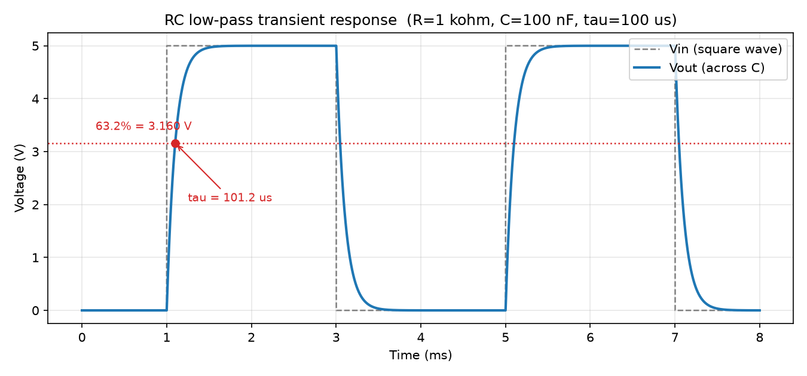

*图 1-1：方波输入下的充放电波形，可以用尺子量出 τ*

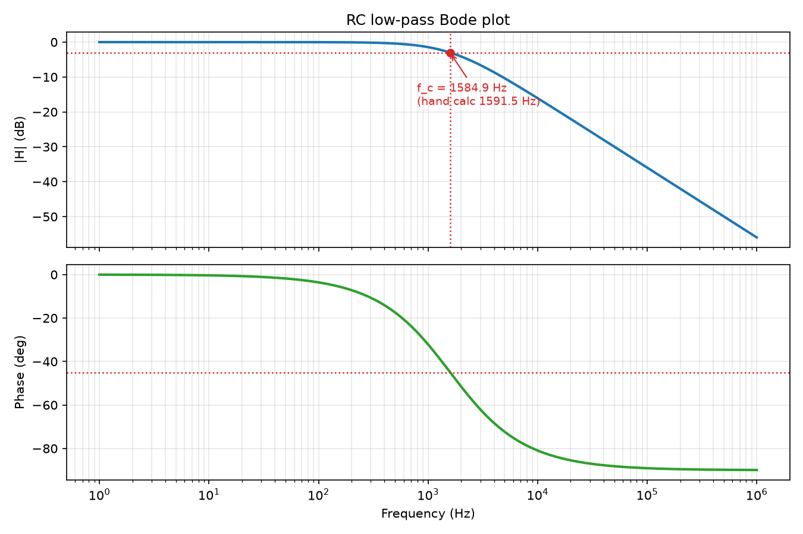

*图 1-2：幅频特性（上）与相频特性（下），−3 dB 处相移 −45°*

**从瞬态波形反推 τ 的方法**：读取输出从 0 上升到稳态值 63.2% 的时刻，得 τ = **101.22 µs**（手算 100.00 µs，误差 1.22%）。另用最小二乘拟合整个充电区间，得 **100.00 µs**，误差 0.00%。

#### 1.4 对比表

| 指标 | 手算值 | 仿真值 | 相对误差 | 误差来源分析 |
|---|---|---|---|---|
| 时间常数 τ（63.2% 读数法） | 100.00 µs | 101.22 µs | 1.22% | **两部分叠加**：①采样步长量化（步长 τ/100 = 1 µs，程序取「第一个 ≥63.2% 的采样点」，系统性取晚）；②脉冲源 1 µs 上升沿带来的固定滞后。拆解见 1.5 |
| 时间常数 τ（最小二乘拟合） | 100.00 µs | 100.00 µs | 0.00% | 拟合用上整个充电区间的全部采样点，量化误差被平摊掉；反过来说明指数模型本身严格成立 |
| 截止频率 $f_c$ | 1591.55 Hz | 1584.89 Hz | 0.42% | **采样离散**：程序在扫频网格上取最接近 −3 dB 的**格点**，而不是在点之间插值。见 1.5 实验 2 |
| −3 dB 处相位 | −45.00° | −44.88° | 0.27% | 同上：取值点与真值 $f_c$ 有偏移，相位随之偏离 |
| 高频衰减斜率 | −20.00 dB/dec | −20.00 dB/dec | 0.00% | 单极点系统的渐近斜率，对数坐标下严格成立 |
| 低频增益 | 0.0000 dB | −0.0000 dB | — | 直流下电容开路，输出等于输入 |

⚠️ 上表没有一条写「误差可忽略」——每条都给出了可量化的原因，并且**都已经过对照实验确认**（见下节）。

#### 1.5 误差来源的排除实验

方法：**改变一个变量，看误差是否随之变化**。四个实验都写在 `rc_filter.py` 里，跑一次脚本自动打印。

**τ 的 1.22% 误差拆成两部分**

| 实验 | 改变什么 | 观察结果 | 结论 |
|---|---|---|---|
| 1a | 采样步长 1 µs → 0.1 µs（τ/100 → τ/1000） | 误差 1.22% → **0.55%**，只缩到 **0.45 倍** | 若误差纯粹来自步长量化，步长缩到 1/10、误差也该缩到约 0.10 倍。**没缩够 → 说明还有别的成分** |
| 1b | 脉冲源上升沿 1 µs → 1 ns（步长保持 τ/1000） | 误差 0.55% → **0.00%** | **确认**：剩下那 0.55% 的固定成分来自脉冲源 1 µs 的上升沿 |

> **实验 1a 是这个分析里最关键的一步——它推翻了「误差只来自步长量化」这个原本的解释。** 如果停在 1a 之前的结论上，就会被 1b 打脸：真实误差是「步长量化 + 源上升沿滞后」两部分叠加的。另外，最小二乘拟合法在两种步长下都稳定在 0.00%，从反面印证了读数法的问题出在「取第一个越限点」这个判据本身，而不是波形数据有问题。

**$f_c$ 的 0.42% 误差来自采样离散**

| 实验 | 改变什么 | 观察结果 | 结论 |
|---|---|---|---|
| 2a | 扫频点数 100 → 200 点/十倍频 | 误差 0.42% → **0.42%**，**纹丝不动** | 加密网格**无效**——1584.89 Hz 恰好等于 $10^{3.2}$，是两套网格**共同的格点**，取最近点永远还是它 |
| 2b | 把 $f_c$ 从「取最近格点」改成「相邻两点对数插值」 | 误差 0.42% → **0.0039%** | **确认**：误差确实来自「取最近格点而非插值」 |

> 2a 的「失败」和 2b 的成功是一对，缺一不可：只看 2a 会得出「这个误差跟采样离散无关」的错误结论，但 2b 一插值误差就塌掉两个数量级。夹住 −3 dB 的两个格点是 **1584.89 Hz（−2.9921 dB）** 和 **1621.81 Hz（−3.0929 dB）**，真值 1591.55 Hz 落在两者之间，插值比例 18.7%。

---

### 二、戴维南定理验证

#### 2.1 含源二端网络图

**手绘原图**（任务书要求电路图自己画；这一页上半部分还写着电路① 的 $f_c$、$\tau$ 手算与「计算 vs 仿真」对比表）：

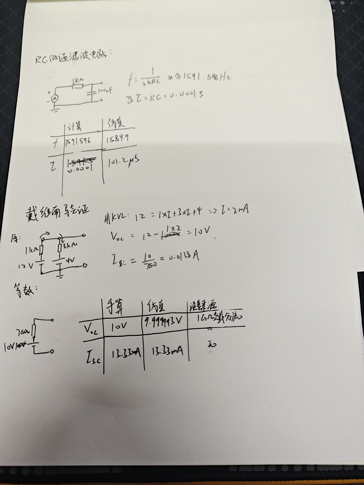

**程序重绘图**（改参数后重跑 `draw_circuits.py` 即可，保证图和仿真脚本永远一致）：

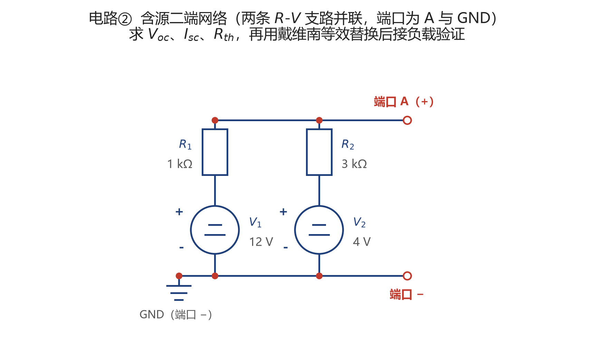

**网络参数**：支路 1 = $R_1$（1 kΩ）串 $V_1$（12 V）；支路 2 = $R_2$（3 kΩ）串 $V_2$（4 V）——两条支路并联在端口上，两个电源正极都朝上（接电阻那一侧）
**端口**：A 为 +，GND 为 −（图上已用红色开口端子标出）

#### 2.2 理论计算

**求开路电压 V_oc（节点分析法）**：对端口节点 A 写 KCL——开路时端口这条"腿"没有电流，所以两条支路电流之和为零

$$\frac{V_A - V_1}{R_1}+\frac{V_A - V_2}{R_2}=0$$

两边同乘 3000：$3(V_A-12)+(V_A-4)=0 \Rightarrow 4V_A=40$

解得 $V_A=10.000000\ \text{V}$，即 $V_{th}=V_{oc}=10.000000\ \text{V}$

**叠加法互验**：$V_{oc}=12\times\frac{3}{1+3}+4\times\frac{1}{1+3}=9+1=10\ \text{V}$——每个电源按"**另一条支路**的电阻占比"投票，$V_1$ 经 1 kΩ 直连、权重 3/4 更大。

**求等效内阻 R_th（独立源置零）**：

$$R_{th}=R_1 \parallel R_2=\frac{1}{1/1000+1/3000}=750\ \Omega$$

**求短路电流**：短路时 $V_A$ 被钳到 0 V，两条支路各自给出 $V_1/R_1=12$ mA 与 $V_2/R_2=1.3333$ mA，全部从端口流出：

$$I_{sc}=\frac{V_1}{R_1}+\frac{V_2}{R_2}=\frac{V_{oc}}{R_{th}}=13.333333\ \text{mA}$$

**自检**：三个量之间满足 $V_{oc}=I_{sc}\cdot R_{th}$；若对不上，先回头查 KCL，别急着写代码。

#### 2.3 仿真方法说明

| 要测的量 | 仿真怎么接 | 从哪读 |
|---|---|---|
| V_oc | 端口开路，**并联 1 GΩ 假负载** | `.op` 的节点电压 |
| I_sc | 端口串一个 **0 V 电压源**当电流表 | 该电压源的支路电流 |
| R_th（验算） | 独立源置零，端口外加 **1 A 电流源** | 端口电压的数值 = R_th |

**为什么端口开路要并联 1 GΩ 假负载**：完全浮空的节点没有直流通路，ngspice 会报 `no DC path to ground` 或直接给出奇异矩阵。加一个极大电阻即可：它与 $R_{th}=750\ \Omega$ 构成分压，让端口电压偏低

$$\frac{R_{th}}{R_{th}+R_{fake}}=\frac{750}{750+10^9}=7.5\times10^{-7}$$

即相对偏差 0.000075%。

**这个数不是凑数的**——它正是表 2-1 里 $V_{oc}$ 那 0.0001% 误差的全部来源（$10\times(1-7.5\times10^{-7})=9.999993$ V，与仿真实测值完全对上），而不是什么"求解器容差"。定义法 $R_{th}$ 由 $V_{oc}$ 相除而来，因此继承同一个偏差；$I_{sc}$ 与激励法都不接假负载，所以是干净的 0.0000%。**把误差归因到自己刻意加进去的元件上，比笼统写"数值容差"更经得起追问。**

**为什么测 I_sc 用 0 V 电压源而不是接一根导线**：0 V 电压源在直流上就是短路，但它**同时是一条可读数的支路**——一次操作同时完成「短路」和「测量」。

#### 2.4 对比表

**表 2-1：等效参数「手算 vs 仿真」**

| 参数 | 手算值 | 仿真值 | 相对误差 | 误差来源 |
|---|---|---|---|---|
| V_oc = V_th | 10.000000 V | 9.999993 V | 0.0001% | **1 GΩ 假负载分流**（偏低 $7.5\times10^{-7}$，见 2.3） |
| I_sc | 13.333333 mA | 13.333333 mA | 0.0000% | 短路测量不接假负载，收敛到打印精度 |
| R_th（定义法 $V_{oc}/I_{sc}$） | 750.000000 Ω | 749.999438 Ω | 0.0001% | 由上面两量相除，把 $V_{oc}$ 那 $7.5\times10^{-7}$ 一并继承 |
| R_th（激励法） | 750.000000 Ω | 750.000000 Ω | 0.0000% | 数值：求解器容差（同样不接假负载） |

**表 2-2：等效电路替换后接负载的验证**（戴维南定理的核心证据）

| R_L | 原网络 V_端口 | 等效电路 V_端口 | 原网络 I (mA) | 等效电路 I (mA) | 是否一致 |
|---|---|---|---|---|---|
| 100 Ω | 1.176471 | 1.176471 | 11.764706 | 11.764706 | ✅ |
| 750 Ω（$=R_{th}$） | 5.000000 | 5.000000 | 6.666667 | 6.666667 | ✅ |
| 1 kΩ | 5.714286 | 5.714286 | 5.714286 | 5.714286 | ✅ |
| 10 kΩ | 9.302326 | 9.302326 | 0.930233 | 0.930233 | ✅ |

**$R_L=R_{th}=750\ \Omega$ 那一行特别值得看**：端口电压恰为 $V_{oc}/2=5.000000$ V，电流 6.666667 mA——这正是**最大功率传输点**（$P=V_{oc}^2/4R_{th}=33.33$ mW），也是"负载与内阻匹配"的定义。

**关于两列的差异**：四个负载点上，两列电压在 1e-6 V 的打印精度内**完全一致**（换成 µV 打印全是 0.000），**不是物理差异**。本电路是纯线性电阻网络，SPICE 建立的方程和手算的方程是同一条，理论上应严格相等，残差只来自浮点迭代收敛。把「数值容差」和「建模误差」区分开，比硬编一个物理原因诚实。

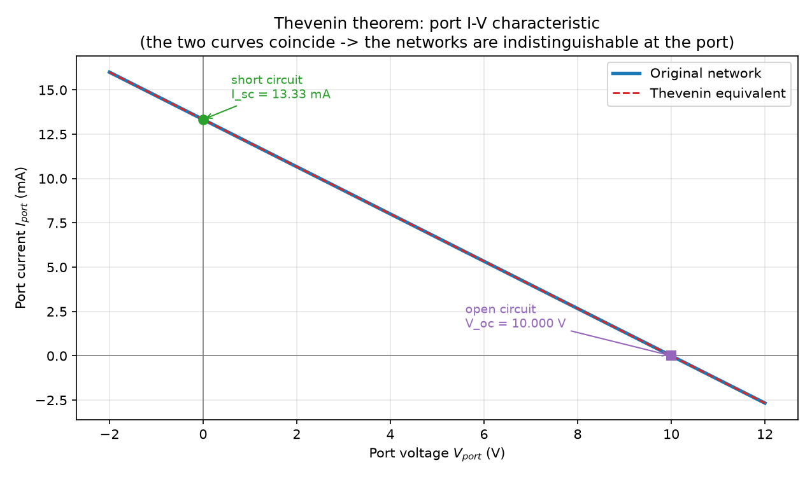

*图 2-1：端口伏安特性。两条曲线最大偏差 0.0000 µA——在端口看来，两个网络完全无法区分*

#### 2.5 结论

**为什么 R_L 越大，端口电压越接近 V_th？** 端口电压 $V_{port}=V_{th}\cdot R_L/(R_{th}+R_L)$。R_L 相对 R_th 越大，分压比越接近 1，端口越接近开路状态，电压自然趋近 $V_{oc}$。反向推到 R_L → ∞ 时电压趋于 $V_{th}$、电流趋于 0，这正是「开路」的定义。所以整条 I-V 特性是一条直线：横截距是 $V_{th}$、纵截距是 $I_{sc}$、斜率是 $-1/R_{th}$。

**戴维南等效成立的前提**：网络必须是**线性**的——否则 $V_{th}$、$R_{th}$ 会随负载改变，「一个电压源串一个电阻」就描述不了它。网络内部允许有受控源，但控制量必须在网络内部。对**非线性负载**等效依然成立，因为从端口往外看，网络本身的行为就是一个 $V_{th}$ 串 $R_{th}$，与外面接什么无关。

---

### 三、NMOS 共源级放大电路

**题目给定参数**：V_DD = 5 V，R_g1 = 60 kΩ，R_g2 = 40 kΩ，R_d = 2 kΩ，C_b1 足够大；
NMOS：K = 0.8 mA/V²，V_th = 1 V，λ = 0.02 /V；输入 v_i = 10 mV 振幅 / 1 kHz 正弦。

#### 3.1 电路图

**题卡原图**（任务书给定，用于对照拓扑）：

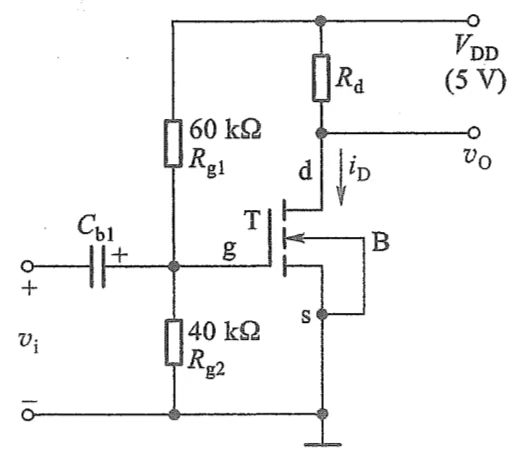

*图 3-0：源极 [s] 与衬底 [B] 短接后接地，输入经 C_b1 耦合到栅极，输出取自漏极 [d]*

**自己画的电路图**（手绘原稿，下半页还有静态分析与 $g_m$、$A_v$ 的手算）：

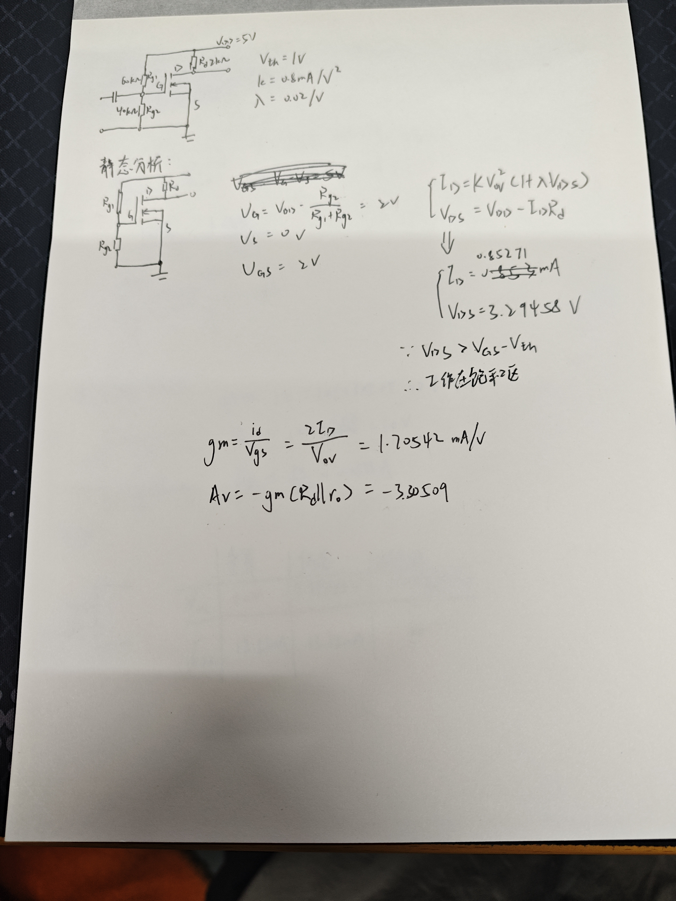

**程序重绘图**（改参数后重跑 `draw_circuits.py` 即可，保证图和仿真脚本永远一致）：

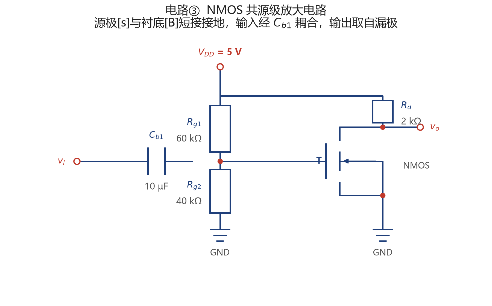

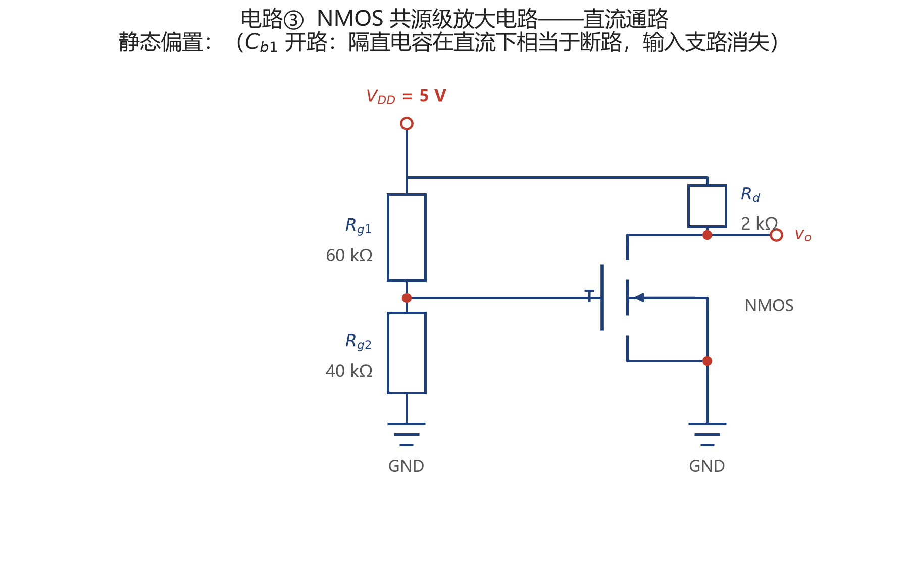

*图 3-2：直流通路（C_b1 开路，输入支路消失，只剩 R_g1/R_g2 分压给栅极）*

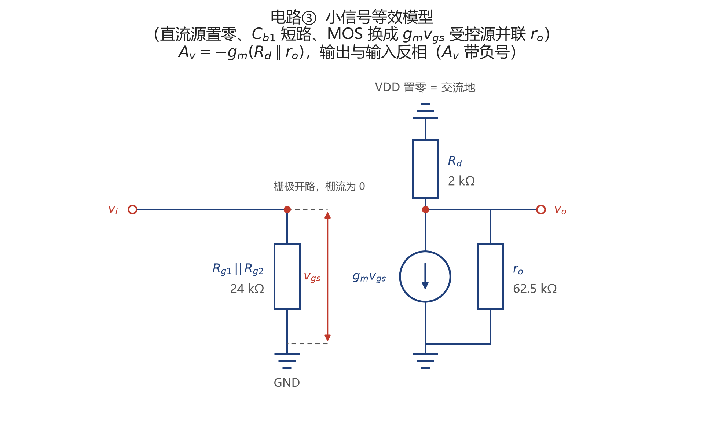

*图 3-3：小信号等效模型（直流源置零、电容短路、MOS 换成 g_m·v_gs 受控源并联 r_o）*

#### 3.2 静态工作点手算

**栅极电位**（源极接地，故 V_GS = V_G）：

$$V_G=V_{DD}\frac{R_{g2}}{R_{g1}+R_{g2}}=5\times\frac{40}{60+40}=2.0000\ \text{V} \;\Rightarrow\; V_{GS}=2.0000\ \text{V}$$

**联立方程**（含沟道长度调制）：

$$I_D=K(V_{GS}-V_{th})^2(1+\lambda V_{DS}),\qquad V_{DS}=V_{DD}-I_D R_d$$

**解法 A · 迭代法**

| 迭代次数 | 假设 V_DS | 1+λV_DS | 算得 I_D | 新 V_DS |
|---|---|---|---|---|
| 0 | 忽略 λ | 1.0000 | 0.8000 mA | 3.4000 V |
| 1 | 3.4000 V | 1.0680 | 0.8544 mA | 3.2912 V |
| 2 | 3.2912 V | 1.0658 | 0.8527 mA | 3.2947 V |
| 3 | 3.2947 V | 1.0659 | 0.8527 mA | 3.2946 V ✅ 收敛 |

**解法 B · 闭式解**：把 $V_{DS}=V_{DD}-I_D R_d$ 代回 $I_D$ 的表达式，整理后得到的是关于 $I_D$ 的**线性**方程——本来就不需要迭代：

$$I_D=\frac{K(V_{GS}-V_{th})^2(1+\lambda V_{DD})}{1+\lambda K R_d(V_{GS}-V_{th})^2}=\frac{0.8000\text{m}\times1.100}{1+0.032}=\frac{0.8800\text{m}}{1.032}$$

**收敛结果**：I_D = **0.852713 mA**，V_DS = **3.294574 V**（两种解法相差 2.0×10⁻⁴ %，即完全一致）

**饱和区判断**：饱和条件 $V_{DS} > V_{GS}-V_{th}$

$$3.2946\ \text{V} \;>\; 2.0000-1.0000=1.0000\ \text{V}$$

即 $V_{DS} > V_{ov}$，**工作在饱和区** ✓。

#### 3.3 小信号参数与增益手算

$$g_m=2K(V_{GS}-V_{th})(1+\lambda V_{DS})=2\times0.8\text{m}\times1.0000\times1.065891=\boxed{1.705426\ \text{mA/V}}$$

**$r_o$ 的两个值**（左 = 教材近似式，右 = 严格偏导，两者正好差一个 $(1+\lambda V_{DS})=1.0659$ 因子）：

$$r_o:\quad \frac{1}{\lambda I_D}=58.6364\ \text{k}\Omega \qquad\text{vs}\qquad \frac{1}{\lambda K(V_{GS}-V_{th})^2}=62.5\ \text{k}\Omega$$

$$A_v=-g_m(R_d \parallel r_o)$$

| 采用哪种 r_o | A_v | 与仿真的误差 |
|---|---|---|
| 教材近似 58.6364 kΩ | −3.298351 | 0.204% |
| **严格 62.5 kΩ** | **−3.305090** | **0.000022%** ✅ |

**输出幅度** = $v_i\times|A_v|$ = 10 mV × 3.305090 = 33.0509 mV，即峰峰值 **66.1018 mV**，相位与输入**反相**。

**物理意义说明**：r_o 在增益里扮演的是「和 R_d 抢电流」的角色。从漏极看出去有两条路通向交流地——一条经 R_d 到电源（交流地），一条经沟道长度调制电阻 r_o 到源极（也是地），所以漏极总电阻是 $R_d \parallel r_o$。r_o 越大这条分流路径越弱，总电阻越接近 R_d，增益越接近理想的 $-g_mR_d$。本题 $r_o=62.5$ kΩ 是 $R_d=2$ kΩ 的 30 倍，并联后只降到 1.938 kΩ（比 2 kΩ 少 3.1%），这就是 r_o 带来的全部影响。若完全忽略 λ（令 λ=0），增益会是 $-g_mR_d=-3.410853$，比真值高 **3.2%**。

#### 3.4 器件模型参数映射（关键）

SPICE level-1 MOS 的电流公式是

$$I_D=\frac{KP}{2}\cdot\frac{W}{L}(V_{GS}-V_{th})^2(1+\lambda V_{DS})$$

而题目给的 $K=0.8\ \text{mA/V}^2$ 就是 $K$ 本身，因此要求

$$\frac{KP}{2}\cdot\frac{W}{L}=K$$

本仿真取 **W = L = 100 µm（W/L = 1）、KP = 1.6 mA/V²、VTO = 1 V、LAMBDA = 0.02**。

ngspice 的 level-1 模型**默认 $W=L=100\ \mu m$**，所以 W/L 天然为 1，脚本里不必显式指定。这一点是实测确认的：搭两个除尺寸外完全相同的电路，一个不指定 W/L、一个显式写 `W=L=100um`，两者的 $I_D$ **相差 0.000000%**，说明默认值确实就是 100 µm。生成网表为：

```
M1 drain gate 0 0 NMOS_MODEL
.model NMOS_MODEL NMOS (KP=0.0016 LAMBDA=0.02 VTO=1 level=1)
```

这条映射如果搞错，Q 点会差好几倍——**所以如果 Q 点对不上，应该先查这里的 KP / W / L 映射，而不是怀疑手算**。

#### 3.5 仿真结果

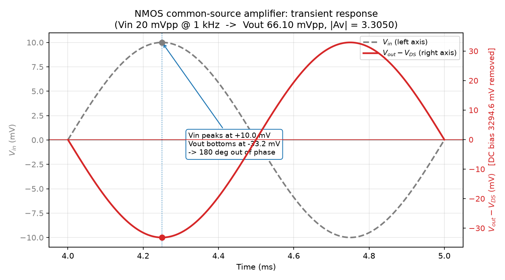

*图 3-4：1 kHz 正弦输入（10 mV 振幅）与输出波形。输出已减去直流偏置 $V_{DS}=3294.6$ mV——否则 66 mV 的摆幅会被 5 V 量程压成一条直线，看不出反相*

**增益测量方法**：增益 = 输出峰峰值 / 输入峰峰值 = **66.1008 mV / 20.0000 mV = 3.305044**

（加分）用 `.ac` 分析在 1 kHz 处读 $|A_v|=3.305089$，与瞬态测值相差 0.0014%，两者互验一致。

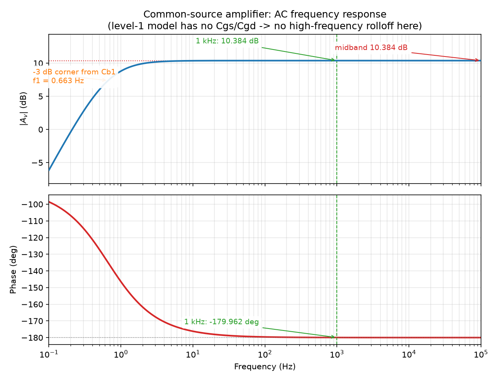

*图 3-5：AC 频率响应。低频侧的转折来自 C_b1 高通；level-1 模型没有 Cgs/Cgd，所以高频侧没有滚降*

#### 3.6 对比表

**表 3-1：静态工作点「手算 vs 仿真」**

| 参数 | 手算值 | 仿真值 | 相对误差 | 误差来源 |
|---|---|---|---|---|
| V_GS | 2.000000 V | 2.000000 V | 0.000000% | 数值：求解器容差 |
| I_D | 0.852713 mA | 0.852713 mA | 0.000000% | 同上 |
| V_DS | 3.294574 V | 3.294574 V | 0.000000% | 同上 |
| 是否饱和 | 是（$V_{DS}>V_{ov}$） | 是 | — | — |

> 本仿真的 level-1 模型与手算公式**同构**（就是同一条平方律），所以 Q 点吻合到 1e-6 量级，差异全部来自 ngspice 的数值求解容差，属于**数值误差**而不是**建模误差**。

**表 3-2：小信号与增益「手算 vs 仿真」**

| 参数 | 手算值 | 仿真值 | 相对误差 | 误差来源 |
|---|---|---|---|---|
| $g_m$ | 1.705426 mA/V | 1.705426 mA/V | 0.000000% | 数值：模型同构，读 `@m1[gm]` 完全吻合 |
| $r_o$ | 58.6364 kΩ | 62.5000 kΩ | 6.589% | **建模**：手算用了教材近似式，见 3.7 实验 4 |
| $A_v$（教材 $r_o$） | 3.298351 | 3.305089 | 0.204% | 建模：上式 6.589% 经 $R_d\parallel r_o$ 并联衰减后的残留 |
| **$A_v$（严格 $r_o$）** | **3.305090** | **3.305089** | **0.000022%** | 数值：求解器容差 |
| 输出峰峰值（用教材 $r_o$） | 65.9670 mV | 66.1008 mV | 0.203% | 建模：同上 |
| AC 相位 @1 kHz | −179.9620° | −179.9620° | 0.000% | 建模：C_b1 高通贡献 0.038° 相位超前，见下 |

#### 3.7 误差来源的排除实验

方法：**改变一个变量，看误差是否随之变化**，从而确认或排除某条原因。四个实验都写在 `mos_common_source.py` 里，跑一次脚本自动打印。

| 怀疑的原因 | 对照实验 | 观察结果 | 结论 |
|---|---|---|---|
| C_b1 不够大导致低频衰减 | C_b1 从 10 µF 加大到 1000 µF（转折 0.663 Hz → 0.0066 Hz） | 增益 3.305044 → 3.305070，变化 **0.0008%** | **排除** |
| 时间步长导致峰值被削 | 步长从 1 µs 减半到 0.5 µs | 增益 3.305044 → 3.305046，变化 **0.0001%** | **排除** |
| level-1 模型与手算公式有差异 | 读器件内部参数 `@m1[gm]` / `@m1[id]` 与手算对照 | 误差 **0.000000%**，模型与手算同构 | **排除** |
| **手算 $r_o$ 用了教材近似式** | 把 $r_o$ 换成严格值 62.5 kΩ 重算 | 误差 **0.204% → 0.000022%** | **确认** ✅ |

**附加实验 · 扰动法测 $g_m$ 为什么不靠谱**：在栅极加 ±0.1 mV 小扰动、看 $\Delta I_D/\Delta V_{GS}$，实测得 **1.652545 mA/V**，比真值 1.705426 mA/V 低 **3.10%**。原因不是模型错，而是 $V_{GS}$ 变化会经 $R_d$ 反馈到 $V_{DS}$，测到的是**闭环跨导**：

$$\frac{g_m}{1+\lambda K R_d(V_{GS}-V_{th})^2}=\frac{1.705426}{1.032}=1.652545\ \text{mA/V}$$

与实测值吻合到 **0.000000%**。所以要用器件本身的 $g_m$，必须直接读 `@m1[gm]`，不能靠扰动法反推。

**那 0.038° 相位是怎么来的**：AC 仿真在 1 kHz 处的相位是 **−179.9620°**，不是理想的 −180°。这不是数值噪声——$C_{b1}$ 与 $R_{g1}\parallel R_{g2}=24$ kΩ 构成高通，转折频率

$$f_1=\frac{1}{2\pi\cdot10\ \mu\text{F}\cdot24\ \text{k}\Omega}=0.663\ \text{Hz}$$

在 1 kHz 处贡献相位超前 $\arctan(0.663/1000)=0.038^\circ$，于是 $-180^\circ+0.038^\circ=-179.962^\circ$，与仿真**精确吻合**。这个 0.038° 是算出来的，不是凑的——它反过来证明了耦合电容在电路里确实按理论在起作用。

---

### 四、总结与踩坑记录

#### 4.1 三项对比汇总

| 电路 | 核心指标 | 手算 | 仿真 | 误差 | 误差类型 |
|---|---|---|---|---|---|
| ① RC 低通 | $f_c$ | 1591.55 Hz | 1584.89 Hz | 0.42% | 数值（扫频点离散） |
| ② 戴维南 | $R_{th}$ | 750.000000 Ω | 750.000000 Ω | 0.0000% | 数值（求解器容差） |
| ③ 共源放大 | $A_v$ | 3.305090 | 3.305089 | 0.000022% | 数值（求解器容差） |

#### 4.2 误差来源分三类

把误差先分类再写，比笼统地说「误差很小」有意义得多：

| 类别 | 含义 | 本题中的例子 |
|---|---|---|
| ① **建模误差** | 手算用的公式本身就是近似的 | 电路③ 的 $r_o=1/(\lambda I_D)$ 忽略了 $(1+\lambda V_{DS})$，造成 0.204% 的增益误差 |
| ② **数值误差** | 仿真求解的离散化与容差 | 电路① 的采样步长量化（1.22%）、AC 扫频点离散（0.42%）；电路② 的 1e-6 量级容差 |
| ③ **模型差异** | 仿真器件模型 ≠ 手算假设 | 本题 level-1 模型与手算公式**同构**，所以这一项为 0 |

三条纪律：**不写「误差可忽略」**；**不编原因**（写不出就做对照实验去找）；**区分「数值容差」和「物理差异」**。

#### 4.3 踩过的坑

| # | 现象 | 原因 | 解决 |
|---|---|---|---|
| 1 | 取数报 `KeyError: 'A'` | ngspice 会把节点名转成小写 | 节点名全部用小写 |
| 2 | 短路电流误差 200% | 按「SPICE 电流方向约定」想当然加了负号，但实测原始读数就是 $+13.333333$ mA | 直接读 `branches['vsc']`，不加负号；先看读数与手算的符号是否一致（完整的查证过程见 5.1） |
| 3 | 端口电流读错 | 读成了 `op.branches['v1']`——那是 V1 支路的电流，不是端口电流 | 改用 $V_{port}/R_L$ |
| 4 | `.dc` 报 `NameError: Sweep variable...` | 语法不对 | 写成 `sim.dc(V1=slice(0, 10, 2.5))` |
| 5 | `.dc` 扫电阻报 `NotImplementedError` | ngspice 把 R 当成内部元件，PySpice 解析不了 | 改成循环重建电路 |
| 6 | `no DC path to ground` / 奇异矩阵 | 测开路电压时端口浮空 | 并联 1 GΩ 假负载 |
| 7 | **增益算出 0.005、相位 −90°（差 10³ 倍）** | 常量 `CB1 = 10e-6` 已经是**法拉**，又写成 `cb1 @ u_uF`，等于再乘 1e-6，实际电容只有 10 pF，高通转折被抬到 663 kHz | 常量已含单位时只能乘 `u_F`。这个 bug 不报错、只是数值不对，最容易误判成「模型参数配错了」 |
| 8 | 调了 `save_internal_parameters` 后 `op.nodes['drain']` 报 `KeyError` | 一旦调用它，ngspice 的 `.op` 原始输出里就只剩被声明的内部参数，PySpice 解析出的 `op.nodes` 变成**空 dict** | 节点电压与器件内部参数**分成两次 `.op`** 拿。此坑无任何报错提示，只会表现为莫名其妙的 KeyError |
| 9 | `op.internal_parameters()` 报 TypeError | 它是**属性**（dict），不是方法 | 去掉括号 |
| 10 | 扰动法测的 $g_m$ 比真值低 3.1% | $V_{GS}$ 变化经 $R_d$ 反馈到 $V_{DS}$，测到的是闭环跨导 | 改读 `@m1[gm]`，见 3.7 |
| 11 | 输出波形图上看不出反相 | 输出叠在 $V_{DS}$ 直流偏置上，66 mV 摆幅被 5 V 量程压成直线 | 画图前先减掉直流分量 |
| 12 | 输出重定向到文件时 `UnicodeEncodeError: 'gbk' codec can't encode '✓'` | 管道/重定向时 Windows 默认用 GBK 编码 | 脚本开头 `sys.stdout.reconfigure(encoding='utf-8', errors='replace')` |
| 13 | 画电路图时电阻框把引线和节点一起吞进去 | 矩形框长度超过了可用跨距 | 框长按跨距自适应：`min(box, 0.72 * span)` |
| 14 | 画虚线报 `ValueError: Input could not be cast to an at-least-1D NumPy array` | `ax.plot(x, y, ls)` 把线型当成格式字符串解析；`"-"` 恰好合法所以一直没暴露，虚线元组才炸 | 用关键字 `linestyle=` |
| 15 | 终端刷 `Exception ignored from cffi callback ... TypeError: a bytes-like object is required` | PySpice 的 `_send_char` 在 Python 3.12 下的兼容问题，**数值全部正确** | 纯噪音，忽略 |
| 16 | `spinit was not found` | 无害提示 | 忽略 |
| 17 | **以为 τ 的误差只来自步长量化** | 做了对照实验才发现：步长缩到 1/10，误差只缩到 0.45 倍——若纯量化应该缩到 0.10 倍。真正的原因是「步长量化 + 脉冲源 1 µs 上升沿滞后」两部分叠加 | 用第二个对照实验（把上升沿压到 1 ns）把剩余误差排除掉，误差归零（完整的对照实验表见 1.5） |

> 第 17 条不是代码 bug，而是**分析上的坑**，也是这次最有价值的一条：第一层解释（「误差来自步长量化」）听起来合理、量级也对得上，但对照实验一做就露馅。**一个变量改变后误差不按预期变化，就说明解释不完整**——这时候应该继续追，而不是把量级对得上的解释当成结论写进报告。

---

### 五、AI 使用声明

> 本节按任务书要求，记录两件事：**我查证后认为 AI 说错的地方**，以及**我自己能讲明白的关键逻辑**。
> 标有 **【待补】** 的地方需要我用**自己的话**填写——这几处正是「防纯粘贴」承诺要考察的部分。

#### 5.1 我查证后认为 AI 说错的地方

任务书要求记录一条「AI 给过但我查证后认为是错误的信息」，**查证过程比结论更重要**。这里有两个候选，选一个展开即可：

**候选一 · 短路电流的符号**

- **AI 的说法**：按 SPICE 的电流方向约定，$I_{sc}$ 在网表里读出来是负的，要自己加一个负号才是正的短路电流。
- **我查了什么**：没有直接采信，而是先跑了一遍仿真读原始读数，再和手算值对照。
- **结论**：**AI 说错了**。实测 `branches['vsc']` 的原始读数就是 $+13.333333$ mA，与手算**符号和数值都一致**；按 AI 的说法加负号后误差直接变成 **200%**。
- **依据**：手算 $V_{oc}/R_{th}$ 得到 $+13.333$ mA，与仿真原始读数符号相同；如果加负号，两者符号相反，相对误差 = 200%。**先用「符号一致性」这个不依赖约定的判据做交叉验证，就不需要去记 SPICE 的电流方向约定。**

**候选二 · $r_o$ 的公式**

- **AI 的说法**：教材公式 $r_o = 1/(\lambda I_D)$。
- **我查了什么**：没有停留在「教材这么写」，而是**用仿真读出的器件内部参数反向验证公式**——调用 `save_internal_parameters('@m1[gds]')` 读出 ngspice 实际用的 $g_{ds}$。
- **结论**：教材式是**近似**的。$r_o=1/(\lambda I_D)=58.6364$ kΩ，而仿真读出 $g_{ds}=1.6\times10^{-5}$ S，即 $r_o=62.5$ kΩ，两者相差 **6.59%**。
- **依据**：$I_D=K(V_{GS}-V_{th})^2(1+\lambda V_{DS})$，严格求导 $\partial I_D/\partial V_{DS}=\lambda K(V_{GS}-V_{th})^2$，所以 $r_o=[\lambda K(V_{GS}-V_{th})^2]^{-1}$，与 $V_{DS}$ 无关；而 $1/(\lambda I_D)$ 是把 $I_D$ 近似成 $K(V_{GS}-V_{th})^2$ 时的写法，**丢掉了 $(1+\lambda V_{DS})=1.0659$ 这个因子**。改用严格值后，增益误差从 **0.204% 降到 0.000022%**——误差的消失本身就是最硬的证据。

#### 5.2 我自己能讲明白的两处关键逻辑

**【待补：必须用自己的话写，两处各 2~4 句】**

任选两处，参考题目：

1. **为什么 RC 电路的输出要取自电容两端才是低通？**
   *提示：分压比 $Z_C/(R+Z_C)$ 随频率怎么变？高频时电容阻抗趋近什么，输出被拉到哪？如果把输出改从电阻两端取，又会变成什么滤波器？*

2. **为什么共源级的增益是负的（反相）？**
   *提示：栅极电压升高 → $v_{gs}$ 升高 → $i_d=g_m v_{gs}$ 变大 → 流过 $R_d$ 的压降变大 → 而漏极电压是 $V_{DD}-i_dR_d$，所以……*

（也可以换成：为什么戴维南等效可以用一个电压源加一个电阻替代整个网络？）

---

### 附：仓库文件结构

```
.
├── README.md                    # 本文档
├── LICENSE                      # MIT
├── tanchishe.html               # 网页端贪吃蛇（前一阶段任务）
└── pyspice-circuits/            # 本阶段：PySpice 三电路
    ├── draw_circuits.py         # 五张电路图的绘图脚本
    ├── rc_filter.py             # 电路① RC 低通
    ├── thevenin.py              # 电路② 戴维南定理验证
    ├── mos_common_source.py     # 电路③ NMOS 共源级放大
    └── images/
        ├── 1.jpg                    # ①② 手绘原稿（含电路①的 τ / f_c 手算与对比表）
        ├── 2.jpg                    # ③ 手绘原稿（含静态分析、g_m、A_v 手算）
        ├── rc_circuit.png           # ① 电路图
        ├── rc_transient.png         # ① 瞬态波形
        ├── rc_bode.png              # ① 波特图
        ├── thevenin_network.png     # ② 含源二端网络（标端口）
        ├── thevenin_load_line.png   # ② 端口 I-V 特性
        ├── mos_problem_card.png     # ③ 题卡原图（任务书给定）
        ├── mos_circuit.png          # ③ 完整电路
        ├── mos_dc_path.png          # ③ 直流通路
        ├── mos_small_signal.png     # ③ 小信号等效模型
        ├── mos_transient.png        # ③ 反相放大波形
        └── mos_ac_bode.png          # ③ AC 频响
```

**选 MIT 协议的理由**：MIT 是目前限制最少的宽松许可证之一，只要求保留版权声明，允许他人自由使用、修改、再分发（包括商用）。这份作业的代码本来就是学习与验证性质、不涉及商业利益，用最宽松的协议既不影响别人借鉴，也避免给后来者制造不必要的麻烦。
